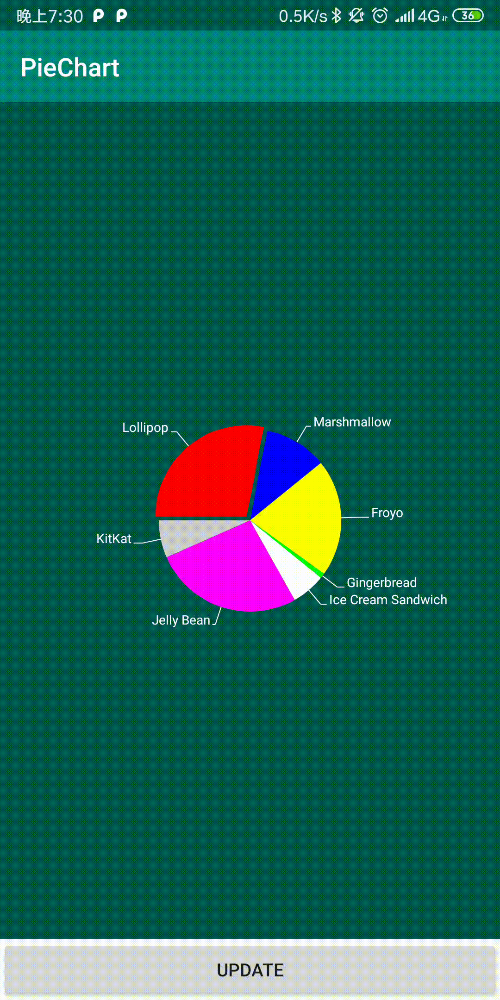
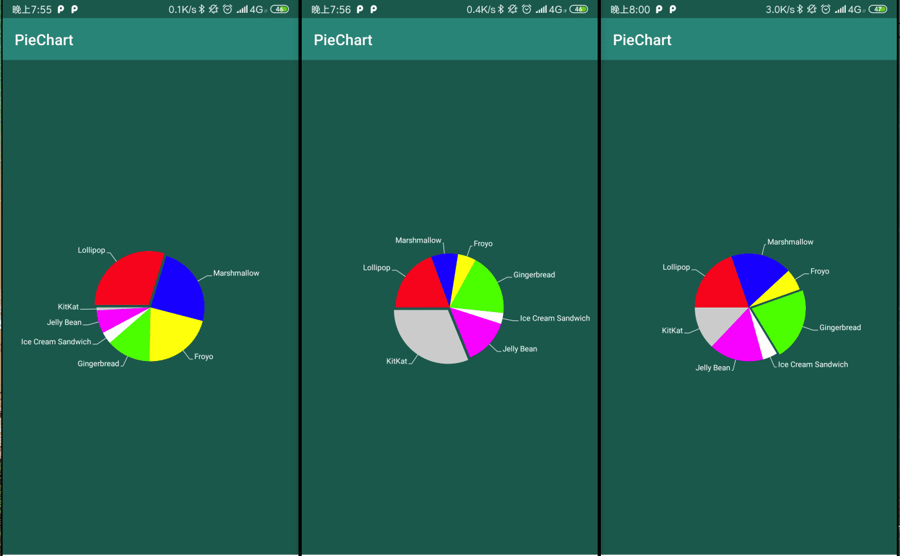

# PieChart

饼图，android 图表。会根据定义PieChartView的大小自动居中，所以如果要调整位置，只需要在xml更改PieChartView位置大小即可

[https://github.com/ccMagic/PieChart](https://github.com/ccMagic/PieChart)

### 1、先看一下效果图：




可能gif加载过慢，可以看下：



### 2、使用方式

示例：

```xml
 <com.github.ccmagic.piechartlib.PieChartView
        android:id="@+id/pieChartView"
        android:layout_width="match_parent"
        android:layout_height="0dp"
        android:layout_weight="1"
        android:background="@color/colorPrimaryDark"
        android:padding="10dp"
        app:pie_chart_mark_line_color="@android:color/white"
        app:pie_chart_mark_text_color="@android:color/white"
        app:pie_chart_mark_text_size="10dp"
        app:pie_chart_max_spacing="3dp"
        app:pie_chart_show_max_part_first="false"
        app:pie_chart_start_angle="-180" />
```

定义的属性：

```xml
  <declare-styleable name="PieChartView">
        <!--最大的饼图是否显示在左上角第一个-->
        <attr name="pie_chart_show_max_part_first" format="boolean" />
        <!--起始绘制角度，-180~+180-->
        <attr name="pie_chart_start_angle" format="float" />
        <!--最大扇区与其他整体的偏移量-->
        <attr name="pie_chart_max_spacing" format="dimension" />
        <!--第一根标注引线的长度-->
        <attr name="pie_chart_mark_line_one_length" format="dimension" />
        <!--第二根标注引线的长度-->
        <attr name="pie_chart_mark_line_two_length" format="dimension" />
        <!--标注引线的颜色-->
        <attr name="pie_chart_mark_line_color" format="color" />
        <!--标注文本大小-->
        <attr name="pie_chart_mark_text_size" format="dimension" />
        <!--标注文本颜色-->
        <attr name="pie_chart_mark_text_color" format="color" />
    </declare-styleable>
```

```java
public class MainActivity extends AppCompatActivity {
    private PieChartView pieChartView;
    private Random random = new Random();

    @Override
    protected void onCreate(Bundle savedInstanceState) {
        super.onCreate(savedInstanceState);
        setContentView(R.layout.activity_main);
        //
        pieChartView = findViewById(R.id.pieChartView);
    }

    /**
     * 点击update按钮开始绘制，每次随机数更换数值
     */
    public void updateClick(View view) {
        ArrayList<PieChartView.Part> list = new ArrayList<>();
        //这里用随机数配置份儿，只是写入对应的值就行，会根据所有添加的数据进行百分比配置
        list.add(new PieChartView.Part("Lollipop", random.nextInt(100) + 1, Color.RED));
        list.add(new PieChartView.Part("Marshmallow", random.nextInt(100) + 1, Color.BLUE));
        list.add(new PieChartView.Part("Froyo", random.nextInt(100) + 1, Color.YELLOW));
        list.add(new PieChartView.Part("Gingerbread", random.nextInt(100) + 1, Color.GREEN));
        list.add(new PieChartView.Part("Ice Cream Sandwich", random.nextInt(100) + 1, Color.WHITE));
        list.add(new PieChartView.Part("Jelly Bean", random.nextInt(100) + 1, Color.MAGENTA));
        list.add(new PieChartView.Part("KitKat", random.nextInt(100) + 1, Color.LTGRAY));
        pieChartView.setPartsData(list);
    }
}
```

### 3、代码原理解析

#### a、PieChartView.Part构造函数

```java
/**
         * @param name 扇形区域名称
         * @param num  扇形区域配置，不用特别按360或100整额处理
         *             因为最终会设置的每个值来调配百分比
         * @param name 扇形区域颜色
         */
        public Part(String name, int num, @ColorInt int color) {
            this.name = name;
            if (num <= 0) {
                throw new IllegalArgumentException("num <= 0 is illegal");
            }
            this.num = num;
            this.color = color;
        }
```

#### b、配合算法

```java
  float sum = 0;
......
        for (int i = 0, size = mPartList.size(); i < size; i++) {
            .......
            //计算所有Part的总和，后面用于根据百分比划分整个圆
            sum = sum + part.num;
        }
.....
    //单个扇形配额，这里用扇形的角度（整个饼图为360度）
    part.sweepAngle = part.num / sum * 360;

```

#### c、最大扇形突出显示原理

根据设置pie_chart_max_spacing属性的值，再结合扇形区域在饼图中的开始和结束角度，用三角函数分别计算x、y偏移量绘制。

详见源码。

#### d、引线绘制原理

1. 先确定每个扇形区域的中心角度，根据三角函数找到坐标，确定绘制起点坐标；
2. 引线第一部分根据pie_chart_mark_line_one_length的值结合三角函数确定结束位置点坐标；
3. 第2步的结束位置点坐标，则为引线第二部分的开始绘制点坐标；
4. 在根据三角函数确定引线第二部分的角度和长度从而确定结束绘制点坐标
5. 文本绘制方向都是从左到用，根据引线第二部分的结束绘制点坐标，以及文本长度确定绘制文本位置。

详情请看源码。

### 持续更新...